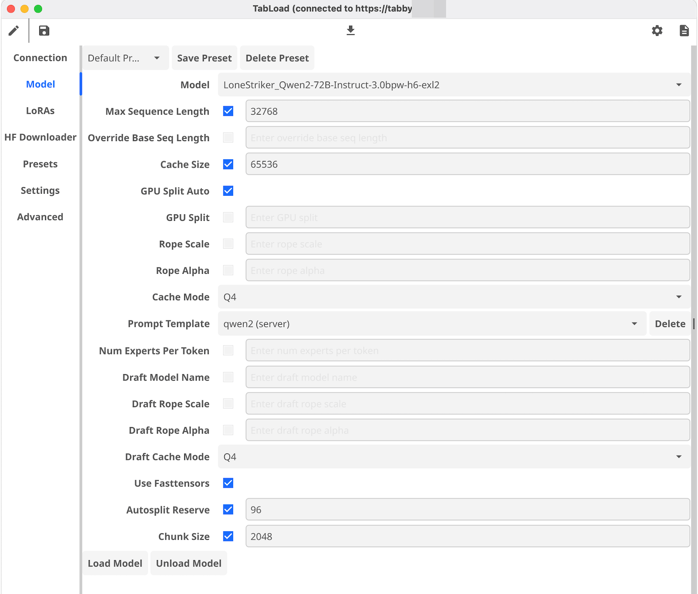

# TabLoad

# TabLoad

TabLoad is a GUI application for interacting with TabbyAPI, providing an easy-to-use interface for managing and using large language models.

## Disclaimer

**IMPORTANT**: TabLoad is currently in early alpha stage. It contains numerous bugs and is not yet suitable for use as stable software. Use at your own risk and expect frequent changes and potential issues.

## Features

- Connect to TabbyAPI instances
- Load and unload models
- Manage LoRAs
- Create and apply presets
- Download models from Hugging Face
- Customizable settings and advanced options



## Usage

1. Launch the TabLoad application
2. Connect to your TabbyAPI instance
3. Load a model and configure settings
4. Start using your language model through the TabbyAPI
5. Experience bugs and crashes 😂

## Development

TabLoad is written in Go and uses the Fyne toolkit for its GUI.

To build the project:

```shell
go build
```

To run the project:

```shell
go run main.go
```

## Contributing

Contributions are welcome! Please feel free to submit a Pull Request.

## License

- Copyright 2024 Sam McLeod
- MIT License

## Acknowledgements

- [Fyne](https://fyne.io/) - Cross-platform GUI toolkit
- [TabbyAPI](https://github.com/theroyallab/tabbyAPI) - API for interacting with large language models
